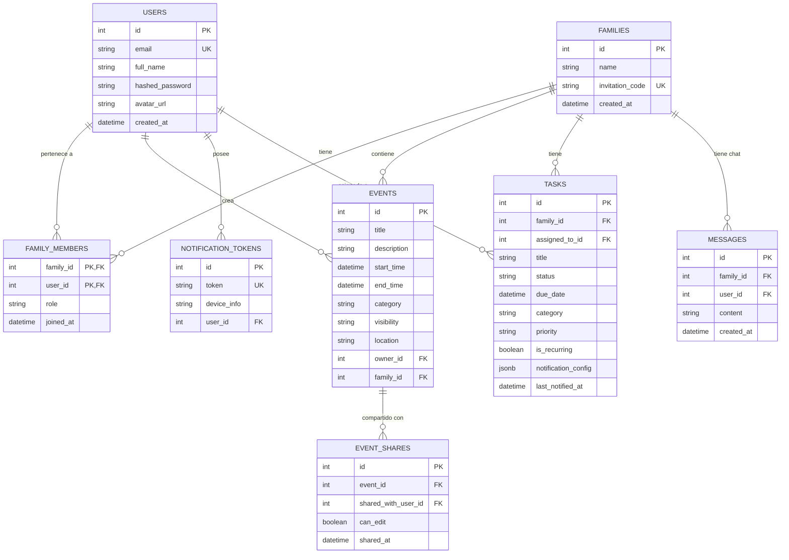

# Documentación de Base de Datos - FamilIAgenda

## Arquitectura General
El sistema utiliza una arquitectura **User-Centric** donde cada usuario tiene su propia cuenta y puede pertenecer a múltiples familias. Los eventos pueden ser privados (solo el creador) o compartidos con familias.

## Diagrama de Relaciones

## Tablas Principales (Actualizado a Plural)

### 1. `users`
Información de cuenta y perfil. Evita conflicto con palabra reservada `user`.

### 2. `families`
Grupos de usuarios que comparten calendario y tareas.

### 3. `family_members`
Tabla pivote N:M entre usuarios y familias con roles.

### 4. `events`
Eventos con soporte de visibilidad granular y ubicación.
- **Constraint**: `end_time > start_time`

### 5. `event_shares`
Permite compartir eventos específicos con usuarios individuales fuera de la lógica familiar.

### 6. `tasks`
Gestión de tareas con soporte avanzado para rutinas:
- **`priority`**: 'critical' activa alertas persistentes.
- **`notification_config`**: Tipo `JSONB` para consultas eficientes.
- **Constraint**: `is_recurring` requiere `recurrence_pattern`.

### 7. `messages`
Historial de mensajes del chat familiar en tiempo real.

### 8. `notification_tokens`
Tokens FCM para envío de alertas a dispositivos.

## Seguridad (RLS)
Todas las tablas tienen **Row Level Security (RLS)** habilitado.
- Si usas el Backend FastAPI, este se conecta con privilegios de servicio (Service Role) y gestiona la seguridad en la capa de aplicación.
- Si conectas el Frontend directamente, las políticas RLS restringirán el acceso.
